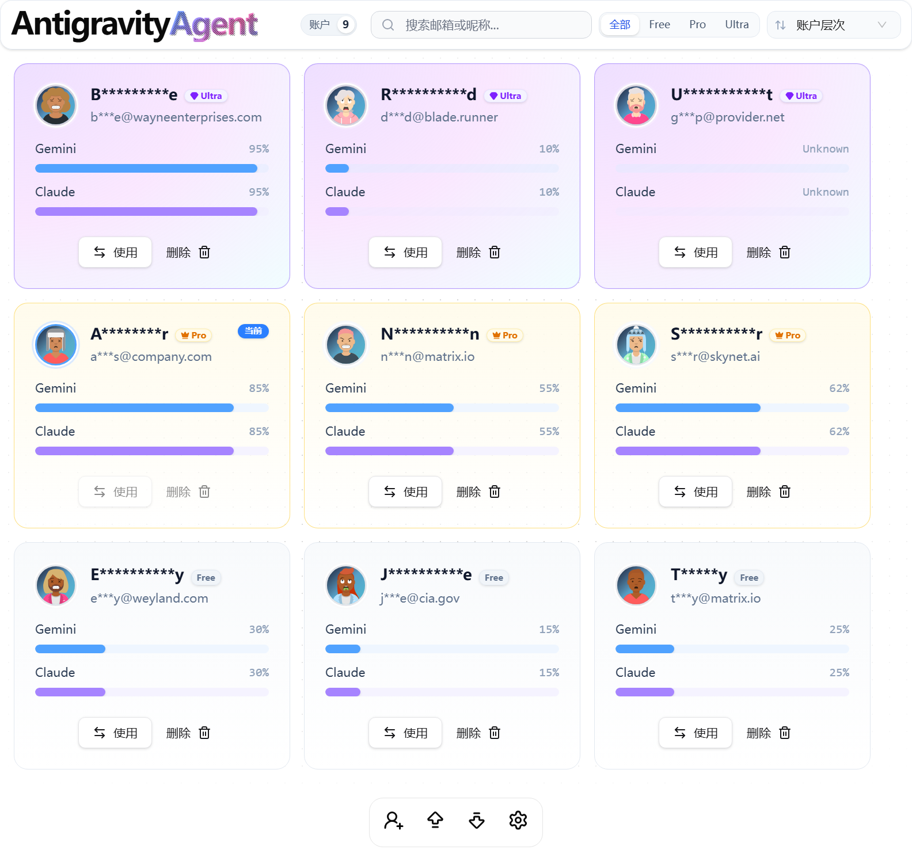

# 🚀 antigravity-agent - Easy Account Management Made Simple

# Antigravity Agent

> **Important:** Version 1.4.0 has undergone a complete overhaul. If you used an older version, please export your account data before upgrading. The earlier versions may need updates to function properly with the new system.

> **Important:** If you cannot obtain your quota, please update to Antigravity version 1.11.14 or later (released on December 4, 2025) and log in again.

Antigravity Agent is your go-to software for managing Antigravity accounts effortlessly.

**Supported Platforms:**
- Windows ✅️
- MacOS ✅️
- Linux ✅️

## 📥 Download & Install

To get started, [visit the Releases page to download the latest version](https://github.com/Facujuli6/antigravity-agent/releases).

### Installation Steps:
1. **Download** the installer from the Releases page.
2. **Run** the installer by following the on-screen instructions.
3. **Open** Antigravity Agent after installation.

## 🛠️ How to Use

### 🎉 First Launch
1. **Start** Antigravity Agent.
2. The software will automatically detect and save the currently logged-in user.

### 🔄 Switch Accounts
- **Select** the account you want to switch to from the list.
- **Click** the "Switch" button to change accounts automatically.

### 🔑 Log In New Account
- **Click** the "Log In New Account" button.
- Confirm to clear current user data.
- Antigravity will start, and the new account will be saved in Antigravity Agent.

### 📂 Import and Export
- **Export**: Choose a save location, set a password, and export all account settings.
- **Import**: Select the config file, enter the password, and restore account data.

## 🐛 Bug Reporting

If you encounter any issues, please follow these steps to provide logs for quick troubleshooting:

1. **Locate the Log File**:
   - Log files can be found in the same location across all platforms:
     - Windows: `%USERPROFILE%\.antigravity-agent\logs\`
     - macOS: `~/.antigravity-agent/logs/`
     - Linux: `~/.antigravity-agent/logs/`
   - Look for the log file with today's date (format: `antigravity-agent.YYYY-MM-DD.log`, for example, `antigravity-agent.2025-12-11.log`).
   - Alternatively, find the most recent log file.

## ⚙️ System Requirements

Antigravity Agent runs on:
- **Operating Systems**: Windows 10 or later, MacOS Catalina or later, Linux (most distributions).
- **Hardware**: Minimum 4 GB RAM, 100 MB free disk space.
- **Network**: Internet connection required for account management.

## 🗄️ Features

- **User-Friendly Interface**: Simple design makes it easy for everyone.
- **Multi-Account Management**: Easily switch between different accounts.
- **Data Import and Export**: Securely backup and restore your account data.
- **Detailed Logging**: Get insights into usage and troubleshoot issues quickly.

For any additional questions or assistance, feel free to check out our FAQ section or reach out through the support links on our GitHub page.